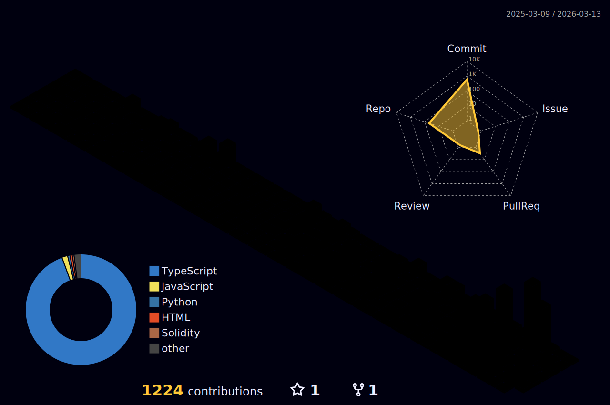

<div align="center">
  
<!-- HERO SECTION -->


<!-- DYNAMIC BADGES ROW -->
<br/>

[](https://github.com/AdwaitBytes)
[](https://github.com/AdwaitBytes?tab=followers)
[](https://github.com/AdwaitBytes?tab=repositories)

</div>

<!-- ANIMATED GRADIENT LINE -->


<!-- ABOUT ME SECTION -->
<h2> &nbsp;About Me</h2>


```yaml
name: Adwait Keshari
located_in: India
education:
  - IIT Madras BS

currently:
  - Building impactful products
  - Contributing to open source
  - Exploring Web3 & blockchain

fields_of_interest:
  - Full Stack Development
  - System Design
  - Distributed Systems
  - Blockchain & DeFi

technical_background:
  - "Languages: TypeScript, Python, Rust, Go"
  - "Frontend: React, Next.js, Vue, Angular"
  - "Backend: Node.js, Express, FastAPI"
  - "Database: PostgreSQL, MongoDB, Redis"
  - "Cloud: AWS, GCP, Azure"
  - "Web3: Solidity, Ethers.js, Hardhat"

currently_learning: ["System Design", "Rust", "ZK Proofs"]
2025_goals: ["Land dream role", "100+ contributions"]

fun_fact: "I debug better after midnight"
```

<br clear="right"/>

<!-- GRADIENT LINE -->


<!-- 3D CONTRIBUTION CALENDAR -->
<h2> &nbsp;3D Contribution Calendar</h2>

<div align="center">
  <picture>
    <source media="(prefers-color-scheme: dark)" srcset="./profile-3d-contrib/profile-night-rainbow.svg" />
    <source media="(prefers-color-scheme: light)" srcset="./profile-3d-contrib/profile-green-animate.svg" />
    
  </picture>
</div>

<br/>

> **Note:** This 3D graph requires the GitHub Action workflow. See [Setup Instructions](#setup-instructions) below.

<!-- GRADIENT LINE -->


<!-- SNAKE ANIMATION -->
<h2> &nbsp;Contribution Snake</h2>

<div align="center">
  <picture>
    <source media="(prefers-color-scheme: dark)" srcset="https://raw.githubusercontent.com/AdwaitBytes/AdwaitBytes/output/github-contribution-grid-snake-dark.svg" />
    <source media="(prefers-color-scheme: light)" srcset="https://raw.githubusercontent.com/AdwaitBytes/AdwaitBytes/output/github-contribution-grid-snake.svg" />
    
  </picture>
</div>

<br/>

> **Note:** Run the Snake workflow first to generate this animation. See [Setup Instructions](#setup-instructions).

<!-- GRADIENT LINE -->


<!-- TECH STACK -->
<h2> &nbsp;Tech Stack</h2>

<div align="center">

### Languages
<p>
  
  
  
  
  
  
  
  
</p>

### Frontend
<p>
  
  
  
  
  
  
</p>

### Backend & Database
<p>
  
  
  
  
  
  
  
</p>

### Cloud & DevOps
<p>
  
  
  
  
  
  
</p>

### Blockchain & Web3
<p>
  
  
  
  
</p>

</div>

<!-- GRADIENT LINE -->


<!-- GITHUB STATS -->
<h2> &nbsp;GitHub Statistics</h2>

<div align="center">

<!-- Stats Row 1 -->
<a href="https://github.com/AdwaitBytes">
  
</a>
<a href="https://github.com/AdwaitBytes">
  
</a>

<!-- Languages -->
<br/><br/>
<a href="https://github.com/AdwaitBytes">
  
</a>

<!-- Activity Graph -->
<br/><br/>
<a href="https://github.com/AdwaitBytes">
  
</a>

</div>

<!-- GRADIENT LINE -->


<!-- DETAILED METRICS -->
<h2> &nbsp;Detailed Metrics</h2>

<div align="center">
  <a href="https://github.com/AdwaitBytes">
    
  </a>
</div>

<div align="center">
  <a href="https://github.com/AdwaitBytes">
    
  </a>
  <a href="https://github.com/AdwaitBytes">
    
  </a>
  <a href="https://github.com/AdwaitBytes">
    
  </a>
</div>

<!-- GRADIENT LINE -->


<!-- TROPHIES -->
<h2> &nbsp;GitHub Trophies</h2>

<div align="center">
  <a href="https://github.com/ryo-ma/github-profile-trophy">
    
  </a>
</div>

<!-- GRADIENT LINE -->


<!-- CONNECT -->
<h2> &nbsp;Connect With Me</h2>

<div align="center">

[](https://linkedin.com/in/adwait-keshari-b5793b294)
[](https://x.com/AdwaitKeshari)
[](https://instagram.com/AdwaitKeshari)
[](https://discord.gg/adwaitkeshari)
[](https://youtube.com/@iitmbs2024)
[](mailto:adwaitkeshari288@gmail.com)

</div>

<!-- GRADIENT LINE -->


<!-- RANDOM DEV QUOTE -->
<h2> &nbsp;Dev Quote</h2>

<div align="center">
  <a href="https://github.com/piyushsuthar/github-readme-quotes">
    
  </a>
</div>

<!-- GRADIENT LINE -->


<!-- SETUP INSTRUCTIONS -->
<details>
<summary><h2 id="setup-instructions"> &nbsp;Setup Instructions</h2></summary>

### Step 1: Enable Repository Settings
1. Go to your profile repo Settings
2. Navigate to Actions > General
3. Enable "Read and write permissions" under Workflow permissions
4. Check "Allow GitHub Actions to create and approve pull requests"

### Step 2: Create Snake Animation Workflow
Create `.github/workflows/snake.yml`:

```yaml
name: Generate Snake Animation

on:
  schedule:
    - cron: "0 */6 * * *"
  workflow_dispatch:

jobs:
  build:
    runs-on: ubuntu-latest
    steps:
      - uses: Platane/snk@v3
        with:
          github_user_name: ${{ github.repository_owner }}
          outputs: |
            dist/github-contribution-grid-snake.svg
            dist/github-contribution-grid-snake-dark.svg?palette=github-dark

      - uses: crazy-max/ghaction-github-pages@v4
        with:
          target_branch: output
          build_dir: dist
        env:
          GITHUB_TOKEN: ${{ secrets.GITHUB_TOKEN }}
```

### Step 3: Create 3D Contribution Graph Workflow
Create `.github/workflows/3d-contrib.yml`:

```yaml
name: 3D Contribution Graph

on:
  schedule:
    - cron: "0 */6 * * *"
  workflow_dispatch:

permissions:
  contents: write

jobs:
  build:
    runs-on: ubuntu-latest
    steps:
      - uses: actions/checkout@v4
      - uses: yoshi389111/github-profile-3d-contrib@latest
        env:
          GITHUB_TOKEN: ${{ secrets.GITHUB_TOKEN }}
          USERNAME: ${{ github.repository_owner }}
      - name: Commit & Push
        run: |
          git config user.name github-actions
          git config user.email github-actions@github.com
          git add -A .
          git commit -m "Update 3D contribution graph" || exit 0
          git push
```

### Step 4: Run Workflows
1. Go to Actions tab
2. Select each workflow
3. Click "Run workflow"
4. Wait for completion

After running both workflows, your 3D graph and snake animation will be generated!

</details>

<!-- FOOTER -->


<!-- VISIT COUNTER -->
<div align="center">
  
</div>

<!-- LAST UPDATED -->
<div align="center">
  <sub>Last updated: Auto-refreshes with GitHub Actions</sub>
</div>
